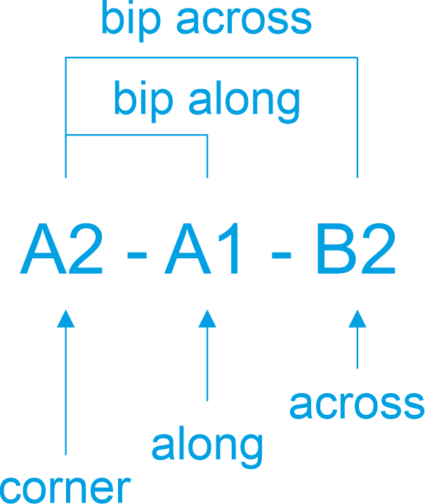
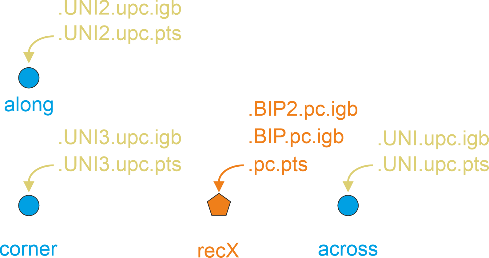

# EnSite X

## Electrode Naming Convention
EnSiteX uses 3 electrodes to create mapping points: Corner, Along, and Across.
The names of electrodes that make up a point are given in the dataset. Naming
convention is as follows:



## Electrode Positions and Signals
For each point the coordinates of the 3 electrodes are given. The actual
position of the recording point (recX in EPPoint) is a point on the plane
spanned by the electrodes.
These coordinates are given in the dataset as "roving_x/y/z".
The EGM signals are related to point clouds as follows:
- bipolar and roving traces &#8594; <map_name>.pc.pts
- unipolar traces &#8594; <map_name>.egm.UNI{*}.upc.pts

{*} is a running number for unipolar signals

Exported EGM traces are indexed depending on the order they were imported.
Which file index corresponds to which EGM trace can be found in an extra export
file: **<map_name>.egm.waveOrder.txt**.
This is a simple text file with the export order for UNI and BIP traces.
Example:
```text
UNI:
uni_across
uni_along
uni_corner
BIP:
bi_across
bi_along
rov
```
This would map unipolar signal traces <map_name>.egm.UNI.igb to uni_across
electrode, <map_name>.egm.UNI2.igb to uni_along electrode, and so on.
The same scheme applies to bipolar signal traces.

For the example above this would represent the point coordinates and signal
traces as shown below:


